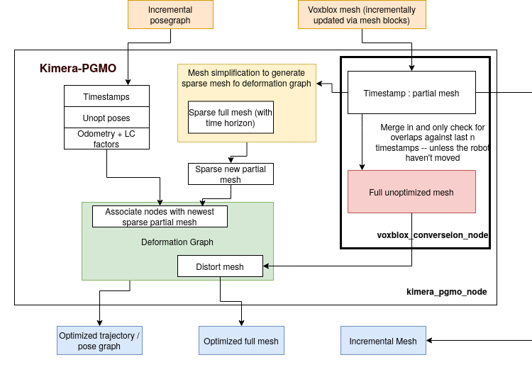

# Kimera-PGMO

## Dependencies 
In addition to PCL, OpenCV, GTSAM, the following pacakges AND THEIR DEPENDENCIES are needed 

[Kimera-RPGO](https://github.com/MIT-SPARK/Kimera-RPGO/tree/feature/multirobot) branch: feature/multirobot

[Kimera-VIO](https://github.mit.edu/SPARK/Kimera-VIO/tree/feature/mesh_deformation) branch: feature/mesh_deformation

[Kimera-VIO-ROS](https://github.mit.edu/SPARK/Kimera-VIO-ROS/tree/feature/deformable_mesh) branch: feature/deformable_mesh

[Kimera-Semantics](https://github.mit.edu/SPARK/Kimera-Semantics)

[VoxBlox](https://github.com/ethz-asl/voxblox)

[Mesh Msgs](https://github.com/yunzc/colorized_mesh_display)

## Architecture 


## Running Kimera-PGMO

### Single robot Kimera

#### Euroc 
In one terminal, launch Kimera-VIO-ROS with stereo dense:
```bash
roslaunch kimera_vio_ros kimera_vio_ros_euroc.launch use_lcd:=true run_stereo_dense:=true
```
Then launch kimera_pgmo:
```bash
roslaunch kimera_pgmo kimera_pgmo.launch dataset:=euroc
```
For visualization, an rviz configuration is provided: 
```bash
rviz -d $(rospack find kimera_pgmo)/rviz/kimera_pgmo.rviz
```
Finally play the rosbag 
```bash
rosbag play V1_01_easy.bag --clock
```

#### Tesse UHumans2 dataset 
In one terminal, launch Kimera-VIO-ROS with stereo dense:
```bash
roslaunch kimera_vio_ros kimera_vio_ros_uhumans2.launch
```
Then launch kimera_pgmo:
```bash
rosunch kimera_pgmo kimera_pgmo.launch launch_voxblox:=false dataset:=uhumans
```
Launch Kimera-Semantics:
```basg
roslaunch kimera_semantics_ros kimera_semantics.launch
```
For visualization, an rviz configuration is provided: 
```bash
rviz -d $(rospack find kimera_pgmo)/rviz/kimera_pgmo.rviz
```
Finally play the rosbag 
```bash
rosbag play some_bag.bag --clock
```