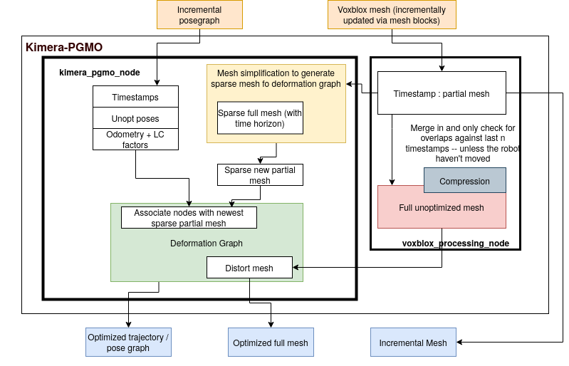

# Kimera-PGMO

Kimera-PGMO (Pose Graph and Mesh Optimizer) is an optimizer that takes in a mesh along with robot odometry and loop closure measurements and then optimizes for the trajectory and the mesh simultaneously. This is done by first creating a deformation graph using the pose graph, the mesh, and the visibility of parts of the mesh from nodes of the pose graph. The optimization problem is then optimized using [Kimera-RPGO](https://github.com/MIT-SPARK/Kimera-RPGO). 


## Dependencies 
In addition to PCL, OpenCV, GTSAM, Kimera-PGMO is designed as part of Kimera, so the following Kimera packages and their dependencies are needed:

[Kimera-VIO](https://github.mit.edu/SPARK/Kimera-VIO/tree/feature/mesh_deformation) branch: feature/kimera_pgmo

[Kimera-VIO-ROS](https://github.mit.edu/SPARK/Kimera-VIO-ROS/tree/feature/deformable_mesh) branch: feature/kimera_pgmo

[Kimera-RPGO](https://github.com/MIT-SPARK/Kimera-RPGO) branch: feature/kimera_pgmo

[pose_graph_tools](https://github.mit.edu/SPARK/pose_graph_tools) branch: feature/multirobot

[Kimera-Semantics](https://github.mit.edu/SPARK/Kimera-Semantics)

For the immediate dependencies, check out the rosinstall files. 

```bash
cd ~/catkin_ws/src
wstool merge Kimera-PGMO/install/kimera_pgmo_ssh.rosinstall
wstool update
catkin build kimera_pgmo
```
Note: doing a full `catkin build` might cause problems with some of the dependencies of Kimera-Semantics, so it is recommended to build the modules one by one. 

## Architecture 
The following is the diagram of our Kimera PGMO architecture.


## Parameters 
Configure the parameters in the params folder for your dataset and environment. 
- `d_graph_resolution` sets how sparse to sample the mesh to obtain the vertices of the deformation graph
- `compression_time_horizon` sets a time horizon to discard older parts of the mesh to avoid associating a new vertex with an old part of the mesh 
- `embed_trajectory_delta_t` the slack to set when synchronizing incoming incremental mesh with incoming pose graph (pose-to-mesh connections)
- `rpgo` the outlier rejection thresholds 
- `output_prefix` the path of where you want to save the optimized mesh (as ply) and the optimized trajectory (as csv) 
- `run_mode` set to 0 for mesh and pose graph optimization and set to 1 for mesh optimization with given optimized pose graph ppublished to `~input_path`
- `use_msg_time` set to true to use the timestamp in msg when synchronizing, and to false if use time of callback 

## Running Kimera-PGMO

### Single robot Kimera

#### Tesse UHumans2 dataset 
In one terminal, launch Kimera-VIO-ROS with stereo dense:
```bash
roslaunch kimera_vio_ros kimera_vio_ros_uhumans2.launch
```
Then launch kimera_pgmo:
```bash
rosunch kimera_pgmo kimera_pgmo.launch dataset:=UHumans2
```
Launch Kimera-Semantics:
```basg
roslaunch kimera_semantics_ros kimera_semantics.launch
```
For visualization, an rviz configuration is provided: 
```bash
rviz -d $(rospack find kimera_pgmo)/rviz/kimera_pgmo.rviz
```
Finally play the rosbag. 
```bash
rosbag play some_bag.bag --clock
```

To save the mesh, do 
```bash
rosservice call /kimera_pgmo_node/save_mesh
```

and to save optimized trajectory, do 
```bash
rosservice call /kimera_pgmo_node/save_trajectory
```
the mesh will be saved to ouput_folder/mesh_pgmo.ply and trajectory will be saved to output_folder/traj_pgmo.csv (see launch file)

## Developer notes 
One thing to note if a developer is working with GTSAM and want to add other factors into the system is that here we specify different prefixes for different types of nodes in the deformation graph, take a look at `utils/CommonFunctions.h` for reference. By prefix we mean the key character as described [here](https://borg.cc.gatech.edu/sites/edu.borg/html/a00244.html). 