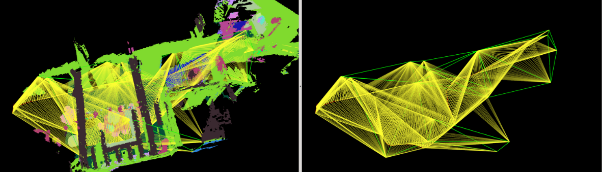
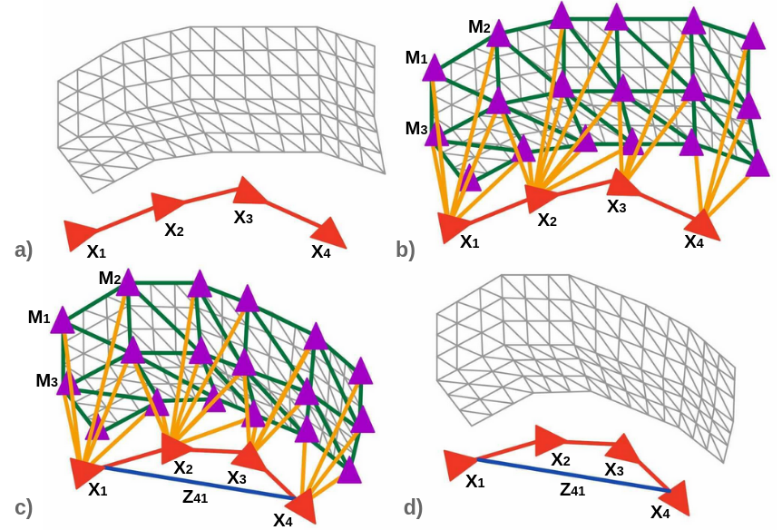

# Kimera-PGMO

Kimera-PGMO (Pose Graph and Mesh Optimizer) is an optimizer that takes in a mesh along with robot odometry and loop closure measurements and then optimizes for the trajectory and the mesh simultaneously. This is done by first creating a deformation graph using the pose graph, the mesh, and the time synchronized connections between the pose graph nodes and the mesh vertices. The optimization problem is then optimized using [Kimera-RPGO](https://github.com/MIT-SPARK/Kimera-RPGO).

If you find this library helpful or use it in your projects, please cite:
```bibtex
@article{rosinol21ijrr-kimera,
	author = {Antoni Rosinol and Andrew Violette and Marcus Abate and Nathan Hughes and Yun Chang and Jingnan Shi and Arjun Gupta and Luca Carlone},
	title ={Kimera: From SLAM to spatial perception with 3D dynamic scene graphs},
	journal = {The International Journal of Robotics Research},
	volume = {40},
	number = {12-14},
	pages = {1510-1546},
	year = {2021},
	doi = {10.1177/02783649211056674}
}
```





## Dependencies 
In addition to PCL, OpenCV, and GTSAM, Kimera-PGMO is designed as part of Kimera, so the following Kimera packages and their dependencies are needed:

[Kimera-RPGO](https://github.com/MIT-SPARK/Kimera-RPGO)

[pose_graph_tools](https://github.com/MIT-SPARK/pose_graph_tools)

[Kimera-Semantics](https://github.com/MIT-SPARK/Kimera-Semantics)

For the immediate dependencies, check out the rosinstall files. 

```bash
cd ~/catkin_ws/src
wstool merge Kimera-PGMO/install/kimera_pgmo_ssh.rosinstall
wstool update
catkin build kimera_pgmo
```

## Parameters 

#### Mesh Frontend
- `horizon` is the compressor horizon. We are currently using an geometric octree based mesh simplification technique, vertices that is outside the horizon will no longer be in the octree allowing a new vertex to be places near it. 
- `output_mesh_resolution` resolution of the full mesh. Set to less than the Kimera-Semantics / Voxblox voxel size if you don't want any simplification on the full mesh.
- `graph_comppression_method` sets the compression method to extract simplified mesh for deformation graph. Recommended: `1`.
- `full_compression_method` sets the compression method for the full mesh. Recommended: `2`.
- `robot_id` can be just set to the default `0` if running single robot. This is really only important for the multirobot case. 
- `d_graph_resolution` resolution of the simplified mesh to be added to the deformation graph. 
- `log_path` path to the folder to save the mesh-frontend log file. 
- `log_output` toggle to log timing and statistics. 

#### Kimera PGMO
- `output_prefix` path to the folder to save the log file and the optimized mesh and trajectory files. 
- `robot_id` can be just set to the default `0` if running single robot. This is really only important for the distributed multirobot case. 
- `run_mode` toggles the different modes. Set to 0 to receive pose graph and mesh and perform simultaneous pose graph and mesh optimization. Set to 1 to optimize the mesh and subscribe to an optimized trajectory.
- `log_output` log timing statistics. 
- `rpgo/` sets various pose graph optimization parameters. See example config.
- `add_initial_prior` adds a prior factor on first node.
- `covariance/` sets the covariance. See example config.

## Running Kimera-PGMO

### Single robot Kimera

#### Tesse UHumans2 dataset 
In one terminal, launch Kimera-VIO-ROS with stereo dense:
```bash
roslaunch kimera_vio_ros kimera_vio_ros_uhumans2.launch
```
Then launch kimera_pgmo:
```bash
roslaunch kimera_pgmo kimera_pgmo.launch dataset:=uHumans2
```
Launch Kimera-Semantics:
```basg
roslaunch kimera_semantics_ros kimera_semantics_uHumans2.launch
```
For visualization, an rviz configuration is provided: 
```bash
rviz -d $(rospack find kimera_pgmo)/rviz/uHumans2.rviz
```
Finally play the rosbag. 
```bash
rosbag play some_bag.bag --clock --pause
```

To save the mesh, do 
```bash
rosservice call /kimera_pgmo/save_mesh
```

and to save optimized trajectory, do 
```bash
rosservice call /kimera_pgmo/save_trajectory
```
the mesh will be saved to ouput_folder/mesh_pgmo.ply and trajectory will be saved to output_folder/traj_pgmo.csv (see launch file)

You can also save the underlying deformation graph to output_folder/pgmo.dgrf 
```bash
rosservice call /kimera_pgmo/save_dgrf
```

#### Loading a mesh and deformation graph
You may also directly load a .ply and .dgrf file to Kimera-PGMO
```bash
roslaunch kimera_pgmo kimera_pgmo.launch dataset:=uHumans2
```
Start rviz:
```bash
rviz -d $(rospack find kimera_pgmo)/rviz/uHumans2.rviz
```
And load mesh and deformation graph:
```bash
rosservice call /kimera_pgmo/load_graph_mesh '{robot_id: 0, dgrf_file: /home/yunchang/catkin_ws/src/kimera_pgmo/kimera_pgmo/log/pgmo.dgrf, ply_file: /home/yunchang/catkin_ws/src/kimera_pgmo/kimera_pgmo/log/mesh_pgmo.ply}'
```

## Developer notes 

### Running the Unit-tests: 
```bash
roscd kimera_pgmo
catkin run_tests --no-deps --this
catkin_test_results ~/catkin_ws/build/kimera_pgmo/
```
You can also run individual tests for example: 
```bash
rostest kimera_pgmo test_mesh_frontend.test --text
```
Or 
```bash
rosrun kimera_pgmo kimera_pgmo-test_deformation_graph
```

### Misc Note
One thing to note if a developer is working with GTSAM and want to add other factors into the system is that here we specify different prefixes for different types of nodes in the deformation graph, take a look at `utils/common_functions.h` for reference. By prefix we mean the key character as described [here](https://borg.cc.gatech.edu/sites/edu.borg/html/a00244.html). 
