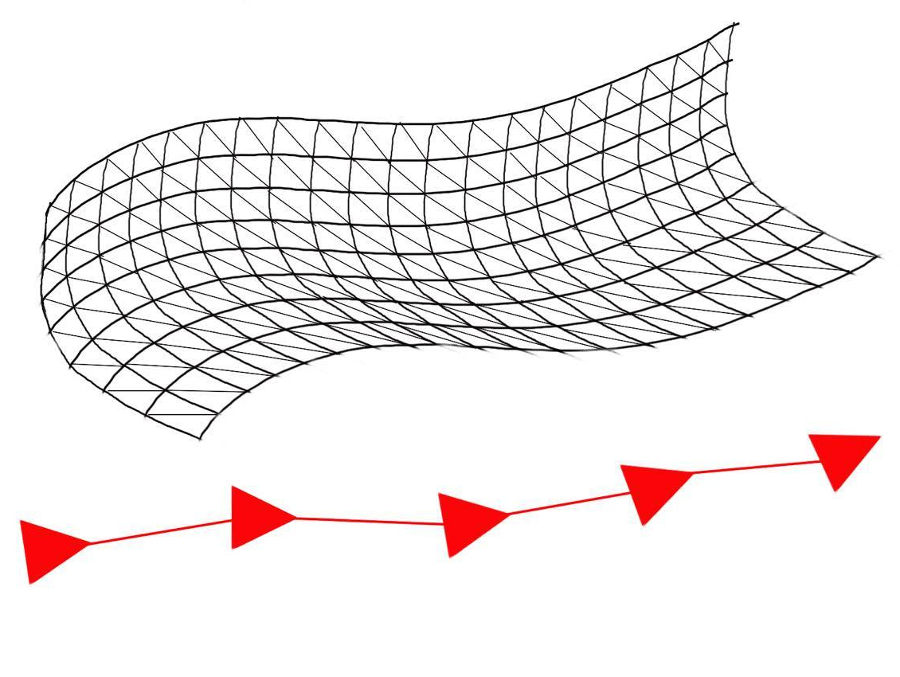
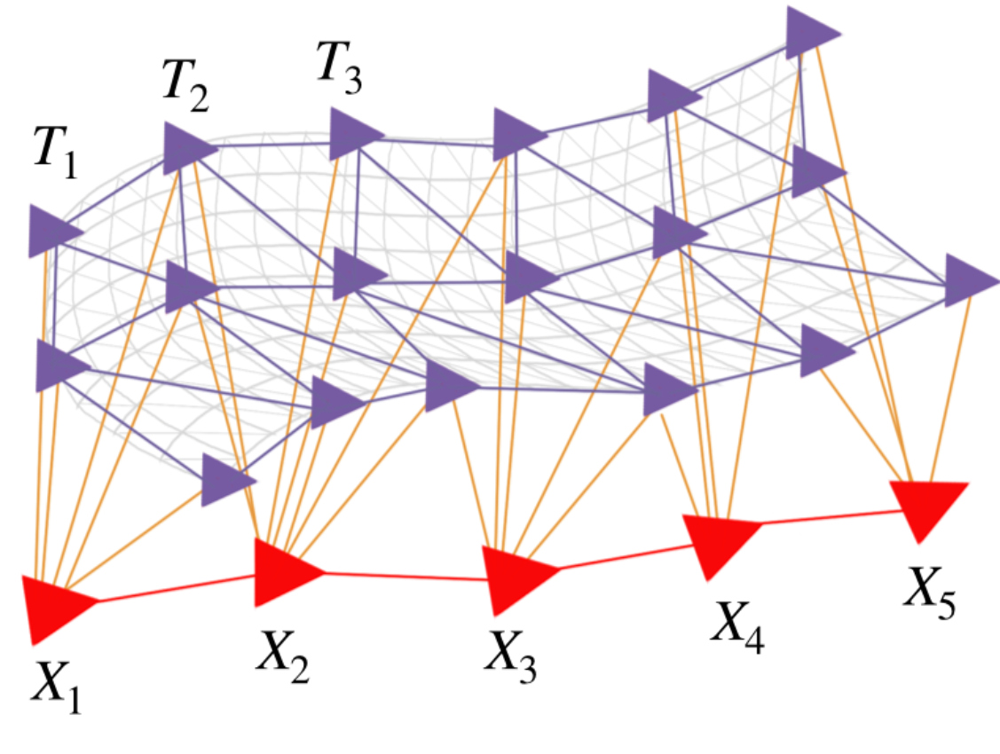
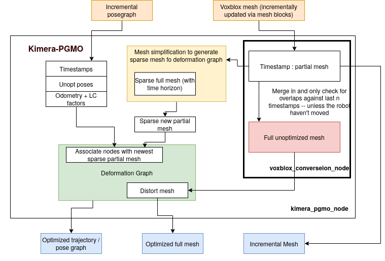

# Kimera-PGMO

Kimera-PGMO (Pose Graph and Mesh Optimizer) optimizes the mesh and the trajectory based on detected loop closures. The deformation of the mesh induced by the loop closure is based on deformation graphs, which is generated by simplifying the mesh and embedding the trajectory pose graph. 

For example, given a mesh and a pose graph trajectory

We generate the embedded deformation graph and optimize simultaneously the mesh and the pose graph when a loop closure is obtained. 


## Dependencies 
In addition to PCL, OpenCV, GTSAM, the following pacakges AND THEIR DEPENDENCIES are needed. Package is set up to run with the following repositories:

[Kimera-VIO](https://github.mit.edu/SPARK/Kimera-VIO/tree/feature/mesh_deformation) branch: feature/mesh_deformation

[Kimera-VIO-ROS](https://github.mit.edu/SPARK/Kimera-VIO-ROS/tree/feature/deformable_mesh) branch: feature/deformable_mesh

[Kimera-Semantics](https://github.mit.edu/SPARK/Kimera-Semantics)

For the immediate dependencies, check out the rosinstall files. 

## Architecture 


## Running Kimera-PGMO

### Single robot Kimera

#### Tesse UHumans2 dataset 
In one terminal, launch Kimera-VIO-ROS with stereo dense:
```bash
roslaunch kimera_vio_ros kimera_vio_ros_uhumans2.launch
```
Then launch kimera_pgmo:
```bash
rosunch kimera_pgmo kimera_pgmo.launch launch_voxblox:=false dataset:=uhumans
```
Launch Kimera-Semantics:
```basg
roslaunch kimera_semantics_ros kimera_semantics.launch
```
For visualization, an rviz configuration is provided: 
```bash
rviz -d $(rospack find kimera_pgmo)/rviz/kimera_pgmo.rviz
```
Finally play the rosbag 
```bash
rosbag play some_bag.bag --clock
```